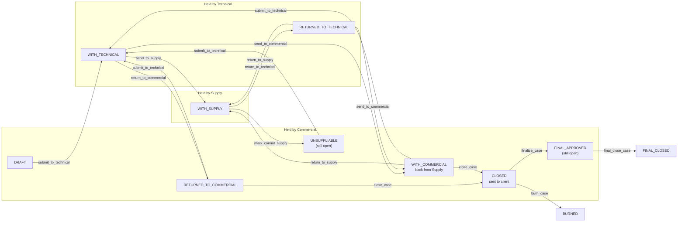
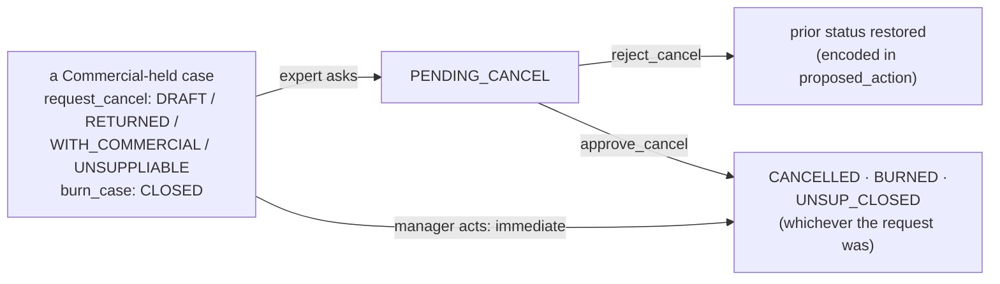
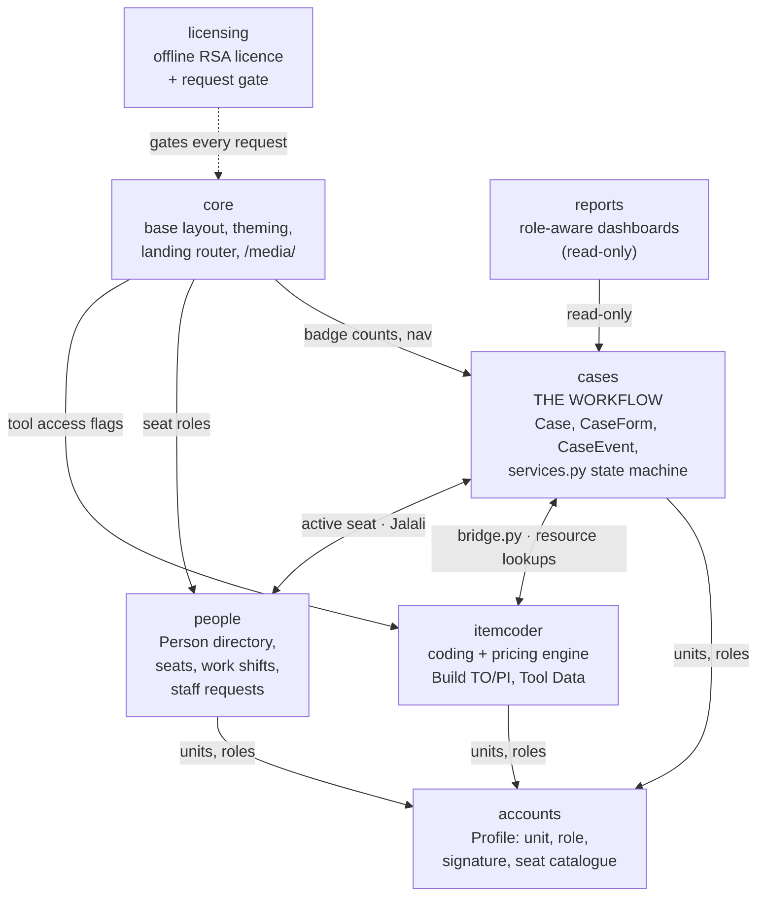
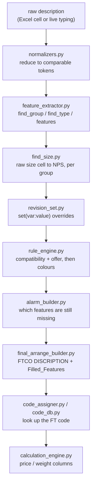

# Architecture — Foolad Tabar Workflow (`ftworkflow`)

The map a developer needs on day one. It describes the code as it is in this
checkout; where something could not be determined from the code it says so.

Companion documents: [`README.md`](README.md) (quick start),
[`DEPLOY.md`](DEPLOY.md) (Docker / production),
[`UPGRADE_NOTES_2026-07.md`](UPGRADE_NOTES_2026-07.md) (one specific upgrade),
[`licensing/README_LICENSING_FA.md`](licensing/README_LICENSING_FA.md) (licence
operations, in Persian).

---

## 1. What the system does

A **case** — the business calls it a *file* (پرونده) — is a single customer
enquiry travelling between three organisational units.

Commercial opens the case from a client's inquiry (an Excel sheet of line
items). It goes to **Technical**, which produces a **Technical Offer (TO)**. If
the case needs pricing it also goes to **Supply**, which produces the
**Proforma Invoice (PI)**. It comes back through Technical to Commercial, who
sends it to the client and then either finalises it or burns it.

Two properties hold everywhere and are the reason the data model looks the way
it does:

* **Every action is an immutable, timestamped event.** `CaseEvent` rows are
  written, never edited or deleted, and they freeze the actor's name and role
  label at the instant they were written (`actor_name`, `actor_role_label`) so a
  later promotion or departure cannot rewrite history.
* **Every form is versioned.** A form is never overwritten in place once it has
  left its unit. `CaseForm` holds one row per version per side; `is_current`
  marks the live one.

### The three units and the roles

| Unit (`accounts.constants.Unit`) | Owns |
|---|---|
| `COMMERCIAL` | Opens cases, holds the client relationship, closes/burns |
| `TECHNICAL`  | Builds the Technical Offer, assigns FTCO codes |
| `SUPPLY`     | Prices the Proforma (Internal and External experts) |

Three roles inside a unit (`accounts.constants.Role`): `MANAGER`,
`SUPERVISOR`, `EXPERT`.

Two cross-cutting flags on `accounts.models.Profile`, which are *not* units:

* `is_admin` — the platform administrator. Reserved to the single login named
  `admin`; `Profile.save()` enforces that and will not let any other account
  hold the flag (see the comment there — the signatory pool depends on it).
* `is_general_manager` — sees every unit's dashboards and archive, creates
  nothing.

Supply experts carry an extra axis, `Profile.supply_kind` ∈ {`INTERNAL`,
`EXTERNAL`}. Supply managers and supervisors do not.

### The flow



Cancel and burn are a second, smaller machine sitting on top of it:



Every status token above is a constant on `cases.constants.CaseStatus`; every
arrow label is a function in `cases/services.py`. `holder_unit` moves with the
status and is what an inbox filters on. The diagrams show the transitions, not
their preconditions — `allowed_actions` adds a great many (a unit must have
built one of its own forms before it can hand the case on; "send to client"
needs every form at the current inquiry version; a new inquiry version can only
be branched from `CLOSED`). Read that function, not the picture, before relying
on an edge.

**Terminal statuses** are exactly four — `FINAL_CLOSED`, `BURNED`, `CANCELLED`,
`UNSUP_CLOSED` (`CaseStatus.TERMINAL`, aliased `ENDED`). Note the two traps:

* `FINAL_APPROVED` is deliberately **not** terminal. A final-approved case is
  still open and can still be final-closed.
* `UNSUPPLIABLE` (no suffix) is **not** terminal either — the case is back with
  Commercial and still actionable. `UNSUP_CLOSED` is the terminal one.

`UNSUP_PEND_SUP` and `UNSUP_PEND_COM` exist in `CaseStatus` but nothing in the
code sets them any more. The two-manager approval chain that used them was
removed as dead — the block comment explaining that sits in `cases/services.py`
just above `_commercial_needs_cancel_approval`. The constants were kept so
historical rows still render, and `reports/views.py` still counts them.

### Cancel and burn need a manager — sometimes

A Commercial **expert** who requests cancel or burn parks the case at
`PENDING_CANCEL` for the Commercial manager to approve or reject. A Commercial
**manager** doing the same acts immediately. `_commercial_needs_cancel_approval`
in `cases/services.py` is the whole rule.

Two details that are easy to get wrong. The status the case should return to if
the manager rejects is stashed in `Case.proposed_action` as a short encoded
string (`cancel:<prior>`, `burn:<prior>`, `cancel_unsuppliable`, or a
side-prefixed variant) — that field is 30 characters and the encodings are
deliberately truncated to fit. And cancelling a case that was `UNSUPPLIABLE`
resolves to `UNSUP_CLOSED`, not `CANCELLED`: it stays labelled "Cannot supply",
because that is what actually happened to it.

---

## 2. The seven apps



Arrows point from the importer to the imported. Two of them are mutual and
worth knowing about: `cases` reads itemcoder's resource helpers when exporting
while itemcoder's `bridge.py` writes `CaseForm` rows back, and `cases` asks
`people.role_nav` which seat is active while `people` borrows `cases.jalali` for
dates. Everything below `accounts` is one-directional: units and roles flow out,
nothing flows back in.

**`core`** — everything site-wide that belongs to no single app: `base.html`,
the per-unit colour palette (`theming.py`), the three context processors that
run on every render, the landing router (`home()`, which decides whether a
signed-in user starts on the admin console, a dashboard or an inbox), and
`protected_media()` which serves `MEDIA_ROOT` behind a login. It has **no
models** and must not grow any — a model here means the concept had no owner.

**`accounts`** — the *seat*: a `User` plus one `Profile` carrying unit, role,
`supply_kind`, signature/stamp images and the seat catalogue fields. It owns
sign-in, forced password change, impersonation, and the admin console for
creating users. It must **not** own workflow rules or personnel records.

**`cases`** — the heart. `Case`, `LineItem`, `CaseForm`, `CaseEvent`,
`CaseExportLog`, `CaseCurrencyLog`, `Client`, `ExpertCode`, `CurrencyRate`,
`SignatureSnapshot`, plus document numbering (`codes.py`), the Jalali calendar
(`jalali.py`), Excel/PDF export (`exports.py`, `pdf_export.py`,
`export_data.py`) and — most importantly — `services.py`, the state machine.
It must **not** own coding or pricing arithmetic; that is itemcoder's.

**`itemcoder`** — the vendored item-coding and pricing engine, formerly the
standalone *codify* tool. Turns free text into an FTCO code and a price, owns
the reference data (JSON schemas, CSV feature tables, per-group SQLite code
files) and the Tool Data admin screens. It must **not** know about case status
or routing; the single seam back into the workflow is `itemcoder/bridge.py`.

**`people`** — the human behind the login. `Person`, `PersonAccount`,
`PersonRole`, seat tenure and event logs, work shifts, the Iranian holiday
calendar, and staff requests (Overtime). Two rules are stated in
`people/models.py` and are worth repeating: *nothing here creates a person by
itself* (no backfill, no import), and *permissions do not read from here* — the
unit/role on the `accounts` profile remains the source of truth for every
access decision. It must **not** become an authorisation source without a
deliberate migration of that decision.

**`reports`** — role-aware dashboards over `cases`. One URL (`/reports/`) that
dispatches on the viewer's role. It has **no models and no migrations of its
own** and must stay read-only: a write here is a workflow action wearing a
dashboard's clothes.

**`licensing`** — offline RSA licence verification (`crypto_core.py`,
`evaluator.py`), the machine fingerprint (`machine.py`), the tamper-evident
sealed state file (`state.py`), and the middleware that redirects every
non-allowlisted request to `/activate/` while unlicensed. It contains no private
key and `crypto_core`/`evaluator`/`state` never import Django, so the security
rules can be exercised standalone. It must **not** learn anything about cases.

---

## 3. The five concepts that cost the most to learn

### 3.1 The case state machine lives in `cases/services.py` — views never mutate status

Every transition is a function in `cases/services.py`. `cases/views.py`
translates HTTP into a service call, checks who may see what, and renders. It
never assigns `case.status` or `case.holder_unit`; nothing outside
`cases/services.py` does (verified by grep across the repo — the only other
`.status =` assignments are `people.staff_requests` and `people.views`, which
are `StaffRequest` and `Person` statuses, unrelated).

The permission answer for "may this person do this now" is
`services.allowed_actions(case, user)` returning a set of action keys; the
visibility answer is the separate `services.user_can_view_case(...)`. They are
deliberately two questions — they were entangled once, and inferring visibility
from a non-empty action set made every case readable by any authenticated user.
Both are pinned independently by the snapshot (§6).

The routing model in one paragraph: when a case lands in Technical or Supply it
is *unassigned* and only that unit's **manager** sees it. The manager may act
directly or assign it to an expert; once assigned, the manager can only view and
the expert works it. Assignment is sticky — `technical_assignee`,
`supply_internal_assignee` and friends mean the case returns to the same expert
next time rather than to the manager's queue. A unit can only hand a case on
after it has built at least one of its own forms.

### 3.2 The Internal / External split

A case has a `price_type` of `INTERNAL`, `EXTERNAL` or `BOTH`. When it is
`BOTH`, the two sides can be delegated to different Supply experts and from that
moment they move **independently** — one side can be closed while the other is
still with Technical.

`Case.split_active` is the switch. It is turned on once, by
`_activate_split_if_needed`, the first time a supply side is delegated on a
`BOTH` case; both sides start wherever the whole case currently is.
`Case.is_split` is the property to test (`split_active AND has_internal AND
has_external`).

**The rule that catches everyone:** once a side is in play, `case.status` and
`case.holder_unit` are no longer the truth for that side. Read
`case.side_status(side)` and `case.side_holder(side)` instead, and write through
`case.set_side_state(side, status, holder)`. The whole-case fields are kept
mirrored by `_sync_sides_to_case` for whole-case transitions (which only run
when the two sides are already together), but a per-side move updates only that
side's columns.

There is **no re-merge**. Each side reaches its own terminal state; only when
*every* side is terminal does `_finalize_split_if_all_terminal` roll a
whole-case outcome up and park `holder_unit` back on Commercial.

Sides also fan out through the rest of the model: `CaseForm.side`,
`CaseEvent.side`, per-side assignees, and `can_act_on_side` /
`can_do_side_action` as the authorisation gate.

### 3.3 Form versioning

`CaseForm` is a snapshot, not a document. One row per (`kind`, `side`,
`version`); `kind` ∈ {`INQUIRY`, `TO`, `PI`}. `columns`/`table`/`meta` are JSON
— rows, header boxes, totals and VAT — which is why forms stay searchable and
re-exportable to Excel/PDF/HTML at any time rather than being frozen files.

* **`is_current`** marks the live snapshot for its kind+side.
  `Case.current_form(kind, side)` is the accessor; it serves from a
  `prefetch_related("forms")` cache when the caller provided one, which is what
  keeps the case-detail page at a couple of queries instead of dozens.
* **`sent`** flips True the moment a version leaves its unit. A sent version can
  never be edited again — the owner must branch a new version. This is the
  mechanism behind "you cannot quietly change a document somebody has already
  received".
* **Version numbers are coupled, not independent.** A TO/PI snapshot's version
  *equals* the current Inquiry version and inherits its generation, so "send to
  client" reduces to "is every form at the Inquiry version and in the same
  generation". See the comment inside `save_form`.
* **`two_stage`** marks the generation. When a TO-only case is upgraded to
  TO & PI mid-flight, the new inquiry keeps the *same* version number (02 stays
  02) but carries the two-stage flag, and the TO/PI built against it inherit it.
  That is what distinguishes the two-stage "Version 02" from the original 02 in
  the version list and on exports. `Case.upgraded_two_stage` and
  `Case.price_upgraded_two_stage` record the same thing at case level.
* **A new inquiry version is only created when something actually changed.**
  `commit_inquiry_version` raises `InquiryUnchanged` otherwise; the exceptions
  (two-stage upgrade, currency-conversion-only reopen, Update price) are
  enumerated in its docstring. Read that docstring before touching the inquiry
  editor.
* **Currency-conversion-only clones** are real `CaseForm` rows that exist so
  Commercial can re-convert a Proforma without routing back through
  Technical/Supply. They are skipped when picking the base for the next real
  version — see the top of `save_form` and `form_is_currency_conversion_only`.
* **`SignatureSnapshot`** freezes who signed, with a *copy* of the name, title
  and image, so changing managers afterwards cannot restate the signature on an
  already-issued document. It is normally written **at the workflow handoff,
  before anyone exports anything**. `_freeze_signatory` in `cases/services.py`
  has two callers: `_publish_current_forms_to`, which freezes the **TO** at the
  one moment it leaves Technical (`leaving_unit == TECHNICAL and kind == TO` —
  deliberately not "the leaving unit signs this kind", see the comment there),
  and `_freeze_commercial_documents`, which freezes the current **PI**s when
  Commercial final-approves (`finalize_case`, and `finalize_side` for one side
  of a split). A proforma is produced by Supply but signed by the *Commercial*
  manager, which is why it is not frozen when it leaves Supply.
  `cases/export_data.py::_get_or_create_signature_snapshot` will also create one
  lazily on first export — but that is the fallback for versions issued before
  the handoff freeze existed, not the usual path.

### 3.4 Seat vs Person vs Role

Three different things that all look like "a user":

* A **seat** is a `User` + `Profile`: a unit and a role — "the commercial
  manager". It is a position in the organisation chart. Seats have a
  `seat_code` (`001`, `002`, …), which is a display index and **not** the login
  name. Its uniqueness pool is wider than "Unit+Role": the constraint
  `accounts_profile_seat_index_pool` (`accounts/models.py`) covers
  `(seat_code, unit, role, supply_kind, is_general_manager, is_admin)`. So
  Supply INTERNAL and Supply EXTERNAL are *separate* pools — two Supply experts
  in the same unit and role can both legitimately hold `001` if their
  `supply_kind` differs — and the constraint only applies at all when
  `seat_code` is neither NULL nor empty. Allocation code written against the
  narrower rule will reject codes the database happily accepts.
* A **person** is the human (`people.models.Person`) — national ID, bank
  details, work shift, education, the lot.
* A **`PersonRole`** is one person holding one seat. One human may hold several
  seats at once (a manager who also covers purchasing).

The login rule: one human has exactly **one** login username — Latin first name,
underscore, Latin last name, then six random digits: `Mahdi_Bayati309214`. The
digits are random so nobody can guess a colleague's username from their real
name. There is no `_2` suffix for a second seat. Extra seats stay linked and
contribute `PersonRole` rows, but carry a vacant username and an unusable
password, so they cannot sign in. See `people/usernames.py` and
`people/seats.py`.

`people/role_nav.py` handles the consequence: when one login holds several
roles, the *active* role is resolved per request and bound to a context
variable, so `cases.services.log()` credits the seat actually being worked
rather than the login. Everything is request-scoped, never module-global,
precisely so a seat cannot leak from one visitor's render into another's.

Sitting alongside this: **Translate** (a substitute temporarily holding a seat —
`CaseEvent.actor_is_substitute` reads the frozen role label to tag it) and
**Delegate** (open tasks moved permanently to another same-role seat, leaving
`Case.is_delegated` and `delegated_from_seat` as a permanent tag). "Open tasks"
for both means every case that is not *ended* — including cases sitting in
Archive that are still actionable.

### 3.5 The itemcoder pipeline, and the SQLite files outside the ORM

One row of free text becomes an FTCO code and a price through a fixed pipeline.
`itemcoder/processor.py` is the front door and its docstring is the authoritative
map; `text_processor.process_text_record_live` is the single function both entry
paths use.



Two entry points, deliberately one engine: `excel_processor` calls it once per
inquiry row during Build TO, and `views.process_row_ajax` calls it for a single
row whenever the user edits Remark or Revision. If they diverged, a row would
change meaning just by being touched.

**The part that surprises people:** the big per-group coding tables do **not**
live in the Django database. Each group's table is its own on-disk SQLite file
at `itemcoder/resources/db/<group>.sqlite3`, opened directly by
`itemcoder/code_db.py` with the `sqlite3` module — no ORM, no migration, not in
`DATABASES`. That is how a multi-million-row `fitting` table stays a
constant-memory indexed lookup instead of an in-RAM pandas DataFrame. A group
with no SQLite file falls back to the original CSV/pandas path in
`code_assigner.py`, and `code_db`'s docstring records that the two were verified
row-for-row on the full pipe table (37,153 rows, 0 mismatches).

Load a table with `python manage.py import_codes <group> <file>` or through
Tool Data → Import. In Docker these files live on the `code_db_data` volume
mounted at `/app/itemcoder/resources/db`, so they survive a rebuild — and they
need their own backup, separate from the Django database.

The rest of the reference data (`data.json`, `feature_schema/*.json`,
`rules_<group>.json`, `offer_<group>.json`, and the feature/size CSVs) sits
under `itemcoder/resources/` and is read through `resource_paths.py`. It is
cached in-process, keyed by mtime or group name; `cache_sync.py` broadcasts an
invalidation to the other gunicorn workers via a sentinel file, and
`startup_warmup.py` fills the caches before the first request.

---

## 4. Where things live

| I want to change… | Look in |
|---|---|
| A workflow transition, or who may take it | `cases/services.py` |
| The list of statuses, events, colours, archive tabs | `cases/constants.py` |
| The case/form/event tables | `cases/models.py` |
| A case screen or the inbox/archive | `cases/views.py`, `cases/templates/cases/` |
| Document number format (`FT-IN-503-102-015-1254-00`) | `cases/codes.py` |
| Jalali dates | `cases/jalali.py` (the single source of truth — never re-implement) |
| Excel export | `cases/exports.py` + `cases/export_data.py` |
| PDF export (headless Chrome/Edge) | `cases/pdf_export.py` + `cases/templates/cases/export/` |
| PI totals, VAT, service price | `cases/export_data.py` (`pi_totals`) |
| FX rates for PI conversion | `cases/fx_rates.py`, `cases/models.CurrencyRate` |
| Units, roles, supply kind, honorifics | `accounts/constants.py` |
| What a user profile holds | `accounts/models.py` |
| Sign-in, forced password change, impersonation | `accounts/views.py`, `accounts/middleware.py` |
| How free text becomes a code | `itemcoder/text_processor.py` (start at `processor.py`) |
| Group/type/feature detection | `itemcoder/feature_extractor.py` |
| The FTCO code lookup | `itemcoder/code_db.py` (SQLite) / `itemcoder/code_assigner.py` (CSV) |
| Price and weight columns | `itemcoder/calculation_engine.py` |
| Which extra columns appear and in what order | `itemcoder/table_layout_manager.py` |
| The Build TO/PI seam between tool and case | `itemcoder/bridge.py` |
| Tool Data admin screens and who may open them | `itemcoder/data_admin.py`, `itemcoder/tool_access.py` |
| Where a JSON/CSV resource lives | `itemcoder/resource_paths.py` |
| Person records, seats, `PersonRole` | `people/models.py`, `people/seats.py` |
| Login name generation | `people/usernames.py` |
| Work shifts, the end-of-shift kick | `people/work_shift.py`, `people/middleware.py` |
| Planned vs worked hours | `people/shift_hours.py` |
| Iranian public holidays | `people/calendar_ir.py` (computed) + `people/iran_holidays.py` (official overrides) |
| Overtime requests | `people/staff_requests.py`, `people/views_requests.py` |
| Dashboards | `reports/views.py` |
| Site colours per unit | `core/theming.py` |
| The shared page shell / left nav | `core/templates/base.html`, `core/context_processors.py` |
| The landing redirect after sign-in | `core/views.home` |
| Licence checks, activation, machine binding | `licensing/` |
| Settings, middleware order, cache, logging | `ftworkflow/settings.py` |
| The URL map | `ftworkflow/urls.py`, then each app's `urls.py` |

Two module docstrings are worth reading before anything else because they are
maps rather than descriptions: `ftworkflow/settings.py` (why the middleware
order is load-bearing) and `itemcoder/processor.py` (the whole coding package in
twenty lines).

---

## 5. How to run it, honestly

### The trap

**Nothing in this project loads `.env`.** There is no `python-dotenv`, no
`django-environ`, no `decouple` — `ftworkflow/settings.py` reads
`os.environ` directly. Docker Compose reads `.env` itself, which is why
production works; a local shell does not.

So the classic `cp .env.example .env && python manage.py runserver` **fails**:

```
django.core.exceptions.ImproperlyConfigured: DJANGO_SECRET_KEY is not set
(or is the insecure placeholder). Set a strong, unique DJANGO_SECRET_KEY in
the environment before running with DJANGO_DEBUG=0.
```

That is `settings.py` refusing to boot a production-mode server on a guessable
key — correct behaviour, badly signposted. You have two ways past it: set
`DJANGO_DEBUG=1` (development mode generates an ephemeral key per process), or
export a real `DJANGO_SECRET_KEY`.

### A command line that actually works

Verified in this checkout: `migrate`, `ensure_schema`, `seed_demo` and `check`
all run clean with nothing but `DJANGO_DEBUG=1` in the environment.

```bash
python -m venv .venv
source .venv/bin/activate            # Windows: .venv\Scripts\activate
pip install -r requirements.txt

export DJANGO_DEBUG=1                # the one variable that matters locally
python manage.py migrate
python manage.py ensure_schema       # adds post-initial columns; idempotent
python manage.py seed_demo           # demo users, clients, expert codes, a case
python manage.py runserver
```

PowerShell:

```powershell
$env:DJANGO_DEBUG = "1"
python manage.py migrate
python manage.py ensure_schema
python manage.py seed_demo
python manage.py runserver
```

To run locally *without* `DEBUG` — closer to production — export a real key
instead, and expect `collectstatic` to be required because the manifest static
storage kicks in:

```bash
export DJANGO_SECRET_KEY="$(python -c 'import secrets;print(secrets.token_urlsafe(64))')"
python manage.py collectstatic --noinput
python manage.py runserver
```

`ensure_schema` is not optional folklore: this project historically ran on
`migrate --run-syncdb`, and a few columns were added to models after the initial
migration. `cases/apps.py` adds them lazily on the first DB connection for an
*existing* database, but on a *brand-new* one the tables do not exist yet at that
moment, so the command closes the gap. `entrypoint.sh` runs the same sequence in
Docker (`migrate --run-syncdb` → `ensure_schema` → `createcachetable` →
`collectstatic`).

Also worth knowing: the cache is a **database** cache (`ft_cache` table), not
per-process memory, because the login throttle must count a lockout across all
gunicorn workers. `createcachetable` creates it. Redis is opt-in via `REDIS_URL`.
If that is set but `django-redis` is not installed, `settings.py` catches the
`ImportError`, keeps the database cache and emits a **`RuntimeWarning`** saying
so ("REDIS_URL is set but the django-redis package is not installed … Using the
database cache for now"). The fallback is therefore not silent — if a server you
believe is on Redis is not, that warning in the start-up log is the explanation.

`FT_SKIP_SCHEMA_SYNC=1` disables the lazy column sync entirely — the snapshot
harness sets it so it can never mutate a schema.

### Demo accounts

`seed_demo` prints them at the end. Passwords are `admin12345` for `admin` and
`pass12345` for everyone else. **Change every one before any real use.**

---

## 6. The safety net: `tests/snapshot.py`

This project has **no unit tests, no HTTP tests and no browser tests**. What it
has instead is one behavioural snapshot, and a new team that does not know it
exists is not protected by it.

`tests/snapshot.py` runs a fixed, wide set of inputs through the real code and
writes every answer to one JSON file. It does not assert what the answers
*should* be — nobody could write that down after the fact for 49,000 lines. It
records what they *are*. Two checkouts that produce byte-identical files behave
identically on every input covered.

Six sections and well over a hundred thousand recorded decisions, the great
majority of them in the routing matrix:

| Section | What it pins |
|---|---|
| `jalali` | Gregorian↔Jalali round trips sampled weekly across 2000–2040, plus every month start, direct Jalali inputs at the month-length boundaries, and out-of-range edges |
| `doc_codes` | Document numbers and export file names for every kind/offer/serial combination |
| `coding_engine` | A 36-item corpus (every product group, fractional inches, Persian digits, blank and nonsense input) through the live row processor, with code lookup both on and off, plus forced group/type overrides |
| `calculation_engine` | Price/weight columns across quantities, sizes, units and overrides chosen to round badly |
| `export_totals` | PI subtotal / VAT / service / grand total, including deleted and NOT-SUPPLIABLE rows that must contribute zero |
| `routing_allowed_actions` | The full (case state × seat) permission matrix — `allowed_actions`, `user_can_view_case`, `can_act_on_side`, `can_do_side_action` |

### How to use it

```bash
python -m tests.snapshot --db /path/to/some.sqlite3 --out before.json
# ... make your change ...
python -m tests.snapshot --db /path/to/some.sqlite3 --out after.json
python -m tests.snapshot --compare before.json after.json
```

`--db` is **copied to a scratch file first** — the database you point at is
never written to, even though the routing section creates users and cases. Any
database whose migrations have run will do. `--only <section>` limits the run.

### How to read the diff

`--compare` prints one line per section and exits non-zero if anything moved:

```
  OK        jalali
  CHANGED   routing_allowed_actions: 4820 changed, 0 removed, 0 added
```

* `IDENTICAL` is the only clean result. For a refactor, the expected diff is
  **zero**.
* **A routing change shows up as thousands of diffs, not one.** The permission
  matrix is a cross-product of case variants × seats, so a single altered
  condition in `allowed_actions` moves every cell that condition touches. Do not
  read "4820 changed" as "4820 bugs" — read it as "one rule moved". Look at the
  first few keys `--compare` prints (it shows fifteen with before/after values)
  and find the single rule they share.
* A recorded `{"__error__": "..."}` entry is a legitimate pinned behaviour: if
  the current code raises on some input, the refactored code must raise the same
  way.
* A `__section_error__` means the section itself blew up — that is a broken
  snapshot, not a passing one.

Determinism rules for anyone extending it: nothing may depend on the wall clock,
on randomness, on dict iteration order, or on database primary keys. Timestamps
are never emitted; sets are sorted before writing. If a section cannot be made
deterministic it does not belong in the file.

---

## 7. Known limits worth inheriting

**`ALLOWED_HOSTS` is `["*"]` on purpose.** This is the owner's decision, not an
oversight and not a TODO. These installs are reached by bare IP on an internal
network and an incomplete host list has broken a deployment before.
Consequently `DJANGO_ALLOWED_HOSTS` is read **nowhere** in this project.
`settings.py` says so at the definition (`ALLOWED_HOSTS = ["*"]`, with the note
above it). The variable nevertheless survives in four other files, and setting
it changes nothing in any of them:

* `docker-compose.yml` (passes it into the container's environment) and
  `.env.example` — inert.
* **`DEPLOY.md` (~84, ~174, ~274) and `UPGRADE_NOTES_2026-07.md` (~66) present
  it as a variable an operator must set correctly**, the second of those even
  claiming the update "makes that setting actually take effect for the first
  time". Both passages are out of date against this checkout. An operator
  following them will spend an afternoon tuning a value nothing reads, and may
  wrongly conclude that a host is being rejected because their list is
  incomplete. Believe this section, not those.

Please do not spend an afternoon wiring it up.

**The licence lock is weaker on Linux than it looks.** `licensing/machine.py`
binds a licence to a hardware fingerprint, but inside a container the signals it
can see are the *container's*. The host bind mount that ties the fingerprint to
the actual machine is present in `docker-compose.yml` and **commented out**:

```yaml
# - /etc/machine-id:/host-machine-id:ro
```

Until an operator uncomments it (Linux hosts only), the binding is to whatever
the container reports, which is a much weaker guarantee.

**Lunar holiday dates are computed and can move.** `people/calendar_ir.py`
generates the Iranian holiday calendar arithmetically so it never runs out of
years. Solar holidays sit on a fixed Jalali date and are exact
(`confirmed=True`). Lunar holidays are computed with the tabular Islamic
calendar, but Iran fixes them by actual moon sighting announced days ahead — so
a computed date can be a day or two off what the country observes. They are
marked `confirmed=False` and must never be presented to a user as
authoritative. `people/iran_holidays.py` holds the override tables where an
official announcement is recorded; overrides always win.

**No HTTP-level or browser test coverage.** `tests/snapshot.py` covers pure-ish
decision surfaces only. Views, templates, JavaScript and anything needing a
browser are untested. The snapshot is the floor, not the ceiling.

**Two caveats inherited from the original build, neither checkable from this
code.** They were carried in the README's old "Status" section; they are
recorded here so they are not lost, but nothing in the repository confirms or
refutes either — treat them as questions for the owner, not as findings:

* *The TO/PI print template was reportedly reconstructed from the written
  specification*, because the original `form-gmi-4.html` was not available. That
  filename appears nowhere in this checkout (confirmed by grep), so the printed
  layout in `cases/templates/cases/export/` cannot be diffed against an original
  here. Anyone who can obtain the original should compare it against a real
  printed TO and PI before the layout is treated as signed off.
* *Coding-grid behaviour was reportedly still to be verified against the real
  reference tables.* `tests/snapshot.py` pins what the coding engine currently
  answers, which protects a refactor — but pinning is not the same as being
  right, and the sample code table `seed_demo` wants is not in the repository
  (see below). Correctness against the customer's own reference tables is an
  open question, not something the snapshot has settled.

**Credential rotation may still be outstanding — confirm it with the owner.**
The only record of this in the repository is `UPGRADE_NOTES_2026-07.md`,
"Before you deploy", step 2, which asks the operator to rotate
`DJANGO_SECRET_KEY`, `POSTGRES_PASSWORD` and the platform superuser's password
"if you haven't already", stating those "were present in a `.env` file that was
shared outside the server at least once". Nothing in this checkout corroborates
that: `.env` is git-ignored and absent from this repository's history, so the
disclosure cannot be confirmed, dated, or shown to have been dealt with from the
code alone. Treat it as a question for the owner rather than an established
fact — and if the answer is "not yet", rotate all three before treating the
install as secure. Rotating `DJANGO_SECRET_KEY` signs out every existing
session, so do it at the end of a working day.

**`seed_demo` cannot load its sample code table in this checkout.** It looks for
`itemcoder/resources/csv/code_table/pipe_coding_data.csv`, which is not in the
repository, and prints `Code import skipped: 'str' object has no attribute
'read'` — a confusing message caused by the importer's fallback branch treating
a missing path as a file object. Everything else `seed_demo` does works. Load a
real table with `python manage.py import_codes pipe <file>` instead.

**Historical dead constants.** `CaseStatus.UNSUP_PEND_SUP` /
`UNSUP_PEND_COM` are never set by any code path (see §1); they are retained for
historical rows. Similarly `Profile.plain_password` is a column that is no
longer written to and was blanked by migration `0007`.
